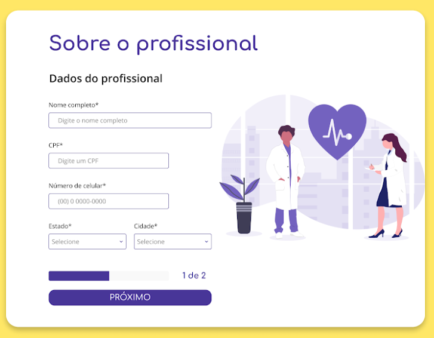

# desafio VUE

## Introdução
<p>Deve ser desenvolvido o Front-end de um Cadastro de Profissional da
Saúde (médico), para isso deve ser utilizado Vue.js e Bootstrap. O Cadastro
é composto por 4 páginas, as quais são descritas nas seções 4 à 7.
</p>
<p>Todos os Requisitos descritos neste documento, serão avaliados, além
da qualidade do código, lógica, organização e usabilidade das páginas. É
importante seguir os requisitos exatamente da forma que foram solicitados, é
recomendado usá-los como checklist. Aviso: leia todos os requisitos antes de
começar o teste.
</p>
 

## Requisitos gerais
<ol>
  <li>Utilizar Vue.js (versão 2 ou superior) como framework JavaScript.
  </li> 
  <li>Utilizar o Bootstrap (versão 4 ou superior) como framework CSS.
</li>
  <li>O design deve ser responsivo (versão mobile e desktop).
</li>
</ol>
 
 ## Requisitos gerais das Páginas

O projeto visual está disponível aqui, vamos deixar os links
necessários em cada requisito. Seguem os links mais importantes:
- Projeto visual da versão mobile
- Projeto visual da versão desktop
○ Imagens do desktop
- Design System (cores, fontes etc)
- Documentação da API
<ol>
<li>Devem ser usadas as cores informadas.
 Utilizar a fonte Comfortaa para títulos e botões, e a fonte Open Sans
para os demais textos.</li>


<li>
 botão no topo das páginas (ver botão) deve ter a função de voltar
uma etapa no cadastro. Ao voltar uma etapa os dados informados pelo
usuário devem ser mostrados.</li>

<li>
 Caso algum campo tenha algum erro, como validação ou não
preenchido, deve aparecer uma mensagem de erro, informando para o
usuário a situação (ver modelo de mensagem de erro).</li>
<li> Todos os campos devem ser obrigatórios.
</li>
<li> Para a utilização da API, consulte a documentação da API.
</li>
<li> Para os botões "PRÓXIMO" da Página 1, "PRÓXIMO" da Página 2 e
"CADASTRAR PROFISSIONAL" da Página 3 deve ser desenvolvido e
utilizado um componente compartilhado. O mesmo componente deve
ser usado nas 3 páginas.
</li>

## Requisitos da Página 1
A Página 1 é composta por 5 campos. Veja a versão mobile e desktop.
<br/>
4.1. O campo "Nome completo" deve ser validado para ter de 3 a 48
caracteres.<br/>

4.2. O campo "CPF" deve seguir o formato 000.000.000-00, exemplo:
239.681.080-43.<br/>

4.3. Quando o usuário preencher todos os números do campo "CPF",
deverá verificar, através da API, se não há um profissional cadastrado
com o mesmo CPF.<br/>

4.4. Caso o CPF já esteja cadastrado, deverá mostrar a mensagem de erro
"CPF já cadastrado" no campo, conforme o modelo.<br/>

4.5. O campo "Número de celular" deve aceitar só números, e deve ter 11
dígitos. E deve seguir o formato (00) 0 0000-0000, exemplo: (51) 9
2253-8347.<br/>

4.6. O campo "Estado" deverá buscar a lista de estados através da API.<br/>


4.7. O campo "Cidade" deverá listar as opções de acordo com o retorno da
API e o estado selecionado.<br/>

Por exemplo: Ao selecionar o estado "Rio Grande do Sul" deverá ser
consultado na API todas as cidades deste estado.


## Requisitos da Página 2
A Página 2 é composta por 4 campos. Veja a versão mobile e desktop.
<br/>

5.1. O campo "Especialidade principal" deve listar o nome das
especialidades retornadas na API.<br/>

5.2. O campo "Informe o preço da consulta" deve aceitar valores entre
30,00 e 350,00. E só deve aceitar números e vírgula.<br/>

5.3. O campo "Formas de pagamento da consulta" deve aceitar mais de
uma seleção (checkbox). Exemplo: é possível selecionar "Em dinheiro"
e "Pix".<br/>

5.4. A opção "Cartão de crédito", do campo "formas de pagamento da
consulta", deve abrir (mostrar) outras opções. Essas novas opções de
Parcelamento só devem aparecer quando a opção de "Cartão de
crédito" for selecionada, e quando a opção de parcelamento aparecer
é obrigatório selecionar uma opção de parcelamento. Veja como deve
ficar a opção de parcelamento, no mobile e desktop.<br/>


##  Requisitos da Página 3

A Página 3 é feita a revisão dos dados, onde deve ser mostrado todos
os dados informados pelo usuários. Veja a versão mobile e desktop, os dados<br/>

apresentados nos projetos são de exemplo.<br/>


6.1. Devem ser mostrados todos os dados informados pelo usuário.<br/>

6.2. Ao clicar em "CADASTRAR PROFISSIONAL" o usuário deve ser
levado para a Página 4;<br/>


6.3. Ao clicar em "Editar cadastro" deve voltar para a Página 1.
<br/>

## Requisitos da Página 4

A Página 4 é a de conclusão do Cadastro. Nesta página o desafio é
diferente, pedimos que você faça o Front-end a partir da sua criatividade,
porém precisa seguir o mesmo padrão visual (cores, fontes e elementos)
estabelecidos.<br/>


7.1. Faça uma página de conclusão de Cadastro, você tem liberdade para
criá-la da forma que achar melhor.<br/>

7.2. A página 4 deve utilizar os mesmos padrões visuais das outras
páginas, como cores e fontes.<br/>


## Instalação


Clone o projeto

```term

git clone https://github.com/moraes3000/vue-desafio-facil-consulta
```

Instale as dependências

```term

npm install

```

Rode o projeto

```term

npm run serve

```
Acesse o seguinte link
```term

- Local: http://localhost:8080/
- Network: http://192.168.1.10:8080/


```

